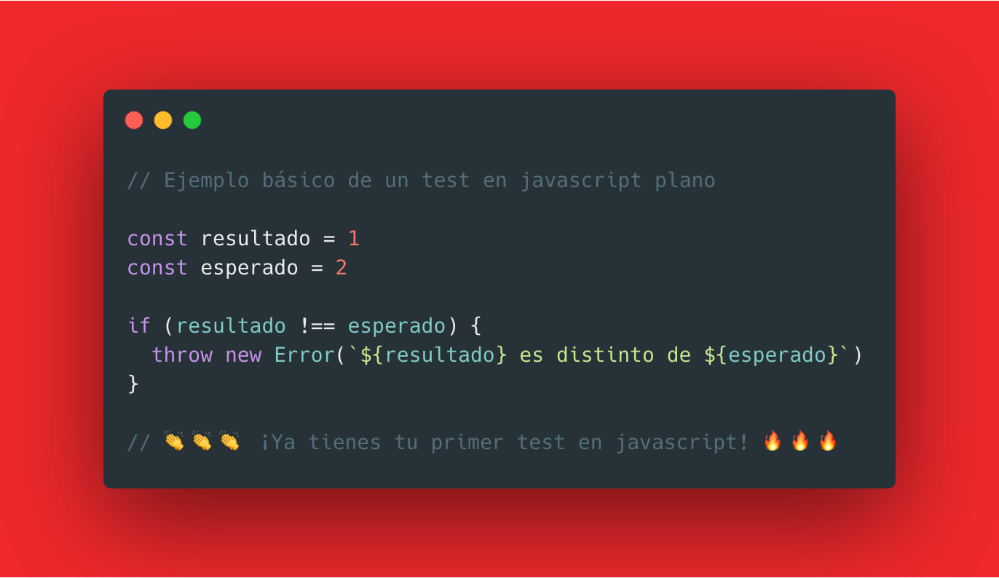
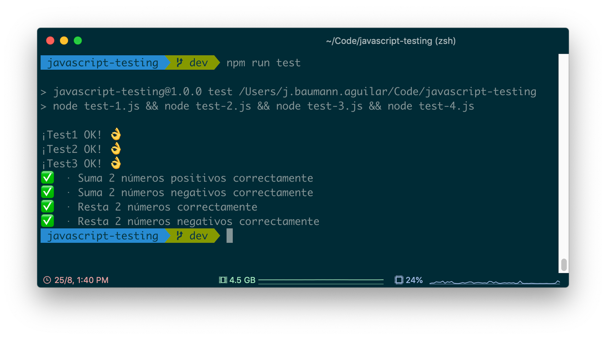
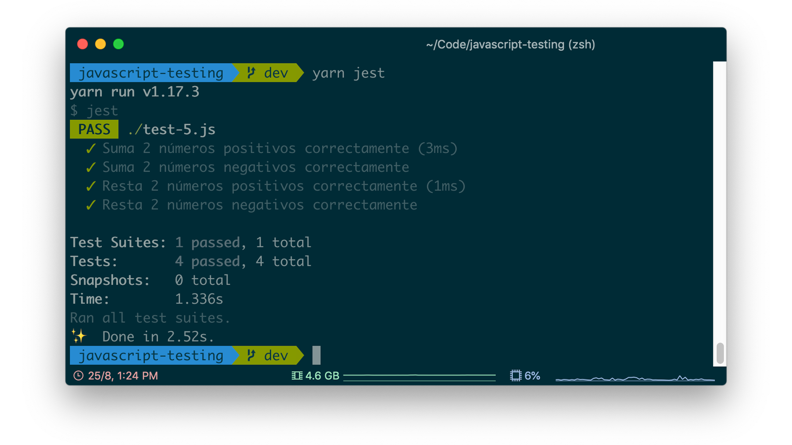

# Introducción al Testing con Javascript

[](https://github.com/baumannzone/javascript-testing/actions)
[](https://github.com/baumannzone/javascript-testing/pulls)
[](https://github.com/baumannzone/javascript-testing/commits/master)


[](#contribuyentes)
[]()

> 👋 ¡Hola! Mi nombre es [Jorge Baumann](https://twitter.com/baumannzone).
>  
> Este repositorio es una introducción práctica a los tests con javascript (_node.js_) guiada por ejemplos progresivos de "0 a framework" 🎉



## Contexto
Hace un mes aproximadamente (_julio 2019_), escribí un artículo en Medium (_que deberías leer si aun no lo has hecho_) que hablaba sobre la importancia de los test o pruebas en nuestros desarrollos de software: [Sobre Pruebas (Testing)](https://medium.com/@baumannsito/about-testing-304fac4034c3).  
Este repositorio, además de ser la continuación de dicho artículo, es también la motivación de continuar hablando, en esta ocasión de manera más práctica y centrándonos en javascript, acerca de las pruebas automáticas en nuestras aplicaciones.  

Además, lancé en twitter un hilo de encuestas acerca de esta temática. Las puedes ver [aquí](https://twitter.com/baumannzone/status/1165178014579273728). 

## Requisitos
Suponemos que, si estás leyendo esto tienes unos conocimientos básicos de programación en general y de javascript en particular.
 
- [git](https://git-scm.com/) (actualmente tengo la `v. 2.21`)
- [Node.js](https://nodejs.org/es/) (actualmente tengo la `v. 12.8`)
- npm (actualmente tengo la `v. 6.11`)

## Ejecución de Tests
Desde la consola de comandos, hacemos lo siguiente:

###### Ejemplo básico
```
node test-0.js
```

###### 1
```
node test-1.js 
```

###### 2
```
node test-2.js
```

###### 3
```
node test-3.js
```

###### 4
```
node test-4.js
```

###### Todos los test
```
npm run test
```




###### 5
```
npm run jest
```




## ¿Dudas? 


## Contribuyentes ✨

Thanks goes to these wonderful people ([emoji key](https://allcontributors.org/docs/en/emoji-key)):

<!-- ALL-CONTRIBUTORS-LIST:START - Do not remove or modify this section -->
<!-- prettier-ignore -->
<table>
  <tr>
    <td align="center"><a href="https://twitter.com/baumannzone"><br /><sub><b>Jorge Baumann</b></sub></a><br /><a href="https://github.com/baumannzone/javascript-testing/commits?author=baumannzone" title="Code">💻</a> <a href="https://github.com/baumannzone/javascript-testing/commits?author=baumannzone" title="Documentation">📖</a> <a href="https://github.com/baumannzone/javascript-testing/commits?author=baumannzone" title="Tests">⚠️</a> <a href="#infra-baumannzone" title="Infrastructure (Hosting, Build-Tools, etc)">🚇</a></td>
  </tr>
</table>

<!-- ALL-CONTRIBUTORS-LIST:END -->

This project follows the [all-contributors](https://github.com/all-contributors/all-contributors) specification. Contributions of any kind welcome!

## Licencia
Este material está disponible para uso privado y no comercial bajo la licencia [GNU General Public License v3.0](./LICENSE)
